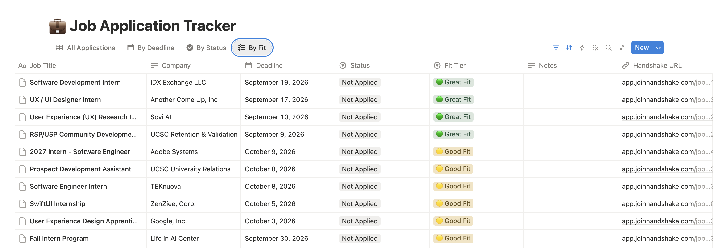
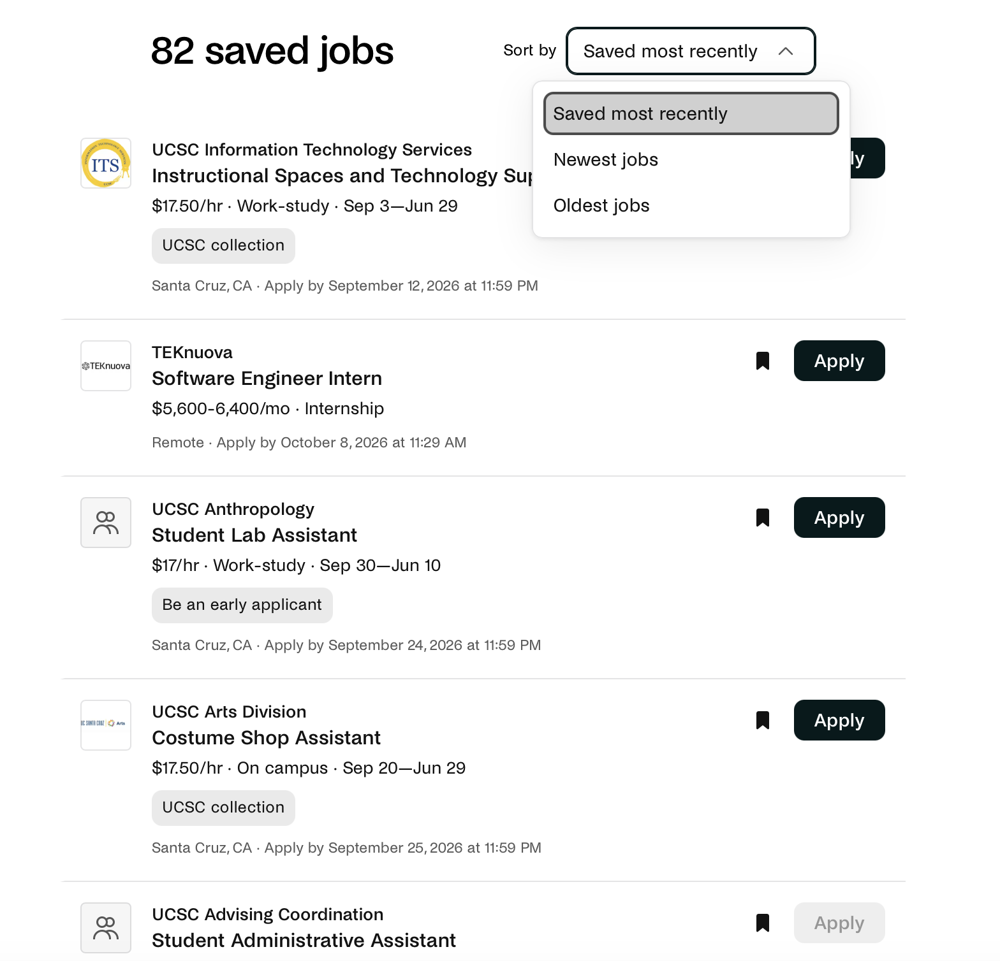
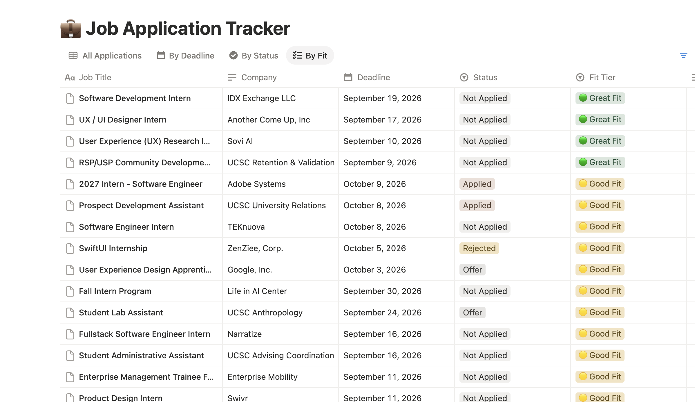
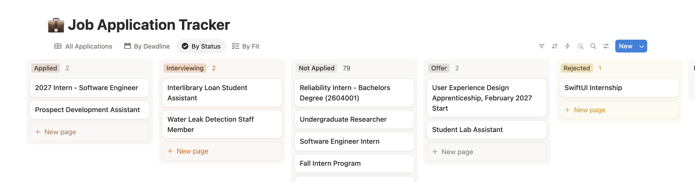
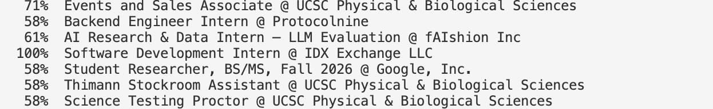
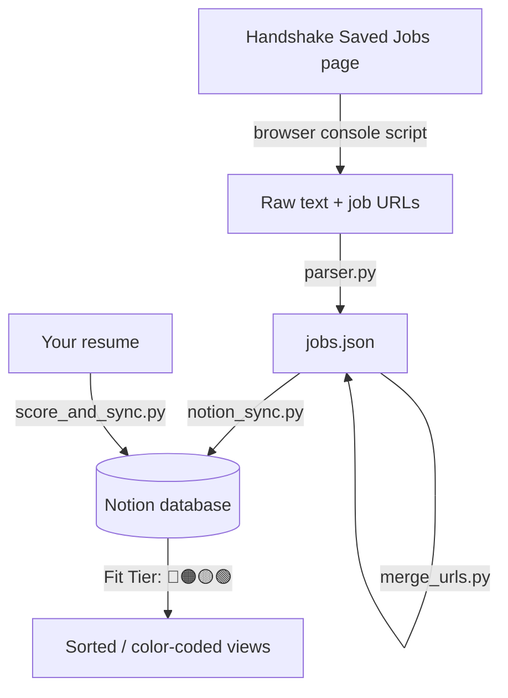

# Job Application Tracker

A pipeline that turns your saved Handshake jobs into a structured, sortable,
color-coded Notion database — with a built-in resume fit scorer. Built to
remove the busywork of manually retyping saved jobs into a tracker, while
staying within Handshake's terms of service (no login automation/credential
scraping — you control exactly what data goes in, and everything runs in
your own logged-in browser tab).

<!--
  SCREENSHOT #1 (hero image): a wide screenshot of your Notion database's
  main table view, showing several real rows with Job Title, Company,
  Deadline, Status, and the colored Fit Tier badges visible. This is the
  single most convincing image in the whole README -- it's proof the
  thing works, not just a claim. Save it as assets/screenshots/overview.png
  and reference it right here:
-->


## Why this exists

Handshake's saved-jobs page only offers three sort options: "Saved most
recently," "Newest jobs," and "Oldest jobs" — notably, **no way to sort
by application deadline.** With dozens of saved jobs across scattered
dates, that makes it easy to lose track of what's actually due soon.



Handshake also doesn't offer a personal API or OAuth connection for a
student's saved jobs, and Notion's Web Clipper only fills in a page
title, not structured columns. This project bridges both gaps: run one
browser script on your Saved Jobs page, and everything downstream —
parsing, deduplication, Notion sync (sortable by deadline), and
resume-fit scoring — happens automatically.

## What it looks like in practice



Jobs sorted by Fit Tier, with the color-coded badge (🔴🟠🟡🟢) making it
easy to scan for your best-fit opportunities first. A separate Board
view grouped by Status also lets you track your actual pipeline as you
apply:



The scorer runs against every job in your database in one pass:




## Architecture



1. **`scripts/handshake_page_collector.js`** — runs in your browser's
   DevTools console on your Saved Jobs page. Pages through your saved
   jobs automatically and downloads two files: the raw page text, and
   each job's real URL (read directly from the page's HTML, no clicking
   into individual jobs).
2. **`src/parser.py`** — turns the raw text into structured JSON
   (title, company, deadline, pay, location), deduplicated and sorted.
3. **`src/merge_urls.py`** — merges the collected URLs into that JSON.
4. **`src/notion_sync.py`** — creates new rows in your Notion database,
   skipping anything already there (safe to re-run anytime).
5. **`src/score_and_sync.py`** + **`src/resume_matcher.py`** — scores
   every job against your resume (keyword/stem overlap with an
   experience-level check) and writes a color-coded `Fit Tier` badge
   into each row.

## Setup

1. **Clone and install dependencies**
   ```bash
   git clone <your-repo-url>
   cd job-tracker
   pip install -r requirements.txt
   ```

2. **Create a Notion integration**
   Go to https://www.notion.so/my-integrations → New integration → copy
   the secret it gives you (may start with `secret_` or `ntn_` depending
   on when your workspace was created — both work).

3. **Create your Notion database** with these properties:

   | Property        | Type   |
   |------------------|--------|
   | Job Title        | Title  |
   | Company          | Text   |
   | Deadline         | Date   |
   | Status           | Select (Not Applied, Applied, Interviewing, Offer, Rejected) |
   | Notes            | Text   |
   | Handshake URL    | URL    |

   Share the database with your integration: `...` menu → **Connections**
   → add your integration.

4. **Configure credentials**
   ```bash
   cp .env.example .env
   # fill in NOTION_TOKEN and NOTION_DATABASE_ID
   ```
   The database ID is the 32-character string in your database's URL
   (make sure you're viewing the database's own full-page URL, not a
   page it's embedded in — see Troubleshooting if you get a 404).

5. **Set up the Fit Tier property automatically**
   ```bash
   python src/setup_fit_tier.py
   ```
   This creates the `Fit Tier` Select property with four color-coded
   options (🔴🟠🟡🟢) via the API — no manual clicking required.

## Usage

**First time / whenever you save new jobs:**

1. Go to your Handshake Saved Jobs page, page 1.
2. Open DevTools Console (F12 → Console), paste in the full contents of
   `scripts/handshake_page_collector.js`, press Enter (type
   `allow pasting` first if your browser blocks the paste).
3. Two files download: `handshake_saved_jobs_raw.txt` and
   `handshake_urls.json`. Move both into this project folder (rename the
   `.txt` one to `my_jobs.txt`, overwriting any previous version).
4. Run:
   ```bash
   python src/main.py parse --input my_jobs.txt --output jobs.json
   python src/merge_urls.py --jobs jobs.json --urls handshake_urls.json --output jobs.json
   python src/main.py sync --input jobs.json
   ```
   `sync` only creates rows for jobs that aren't already in Notion —
   safe to re-run anytime, nothing gets duplicated.
5. Score fit against your resume:
   ```bash
   python src/score_and_sync.py --resume resume.txt
   ```

That five-step loop is the entire ongoing workflow — repeat it whenever
you save more jobs.

## Setting up your Notion views

- **Table view sorted by Deadline** (ascending) — jobs due soonest at top.
- **Board view grouped by Status** — drag jobs through your pipeline.
- **Board view grouped by Fit Tier** — four color columns, best fits on
  the green end.

## Limitations

- **No login automation.** This project never logs into your Handshake
  account programmatically — you paste data yourself; everything
  downstream is automated. This keeps it clear of Handshake's terms of
  service around automated account access, though the "next page"
  clicking is still automated interaction with the page, worth knowing
  going in.
- **Fit scoring uses job titles (plus pay/type), not full descriptions.**
  Handshake's list view doesn't expose full job descriptions, and two
  different technical approaches to capture them (clicking into each job,
  and fetching pages directly) both hit real walls — a third-party
  analytics widget's rate limit, and a hard cross-origin (CORS) browser
  restriction between Handshake's list and detail-page subdomains,
  respectively. Fit scoring is a heuristic signal for prioritizing which
  jobs to look at first, not a hiring prediction.
- **Parser selectors are tuned to Handshake's current layout** and may
  need small adjustments if Handshake changes its page structure, or if
  your school's Handshake instance renders slightly differently.

## Troubleshooting

- **`object_not_found` / 404 from Notion**: your database isn't shared
  with your integration yet, or your `.env` has a *page* ID instead of
  the *database* ID (easy to grab the wrong one if the database is
  embedded in a page). Run `python src/check_notion_access.py` — it
  lists every database your integration can actually see, with the
  correct ID for each.
- **400 error mentioning "is a page, not a database"**: same root cause
  as above — you copied a page URL. Open the database in its own
  full-page view (look for an expand icon on an inline database) and
  copy the URL from there.
- **Browser console won't run the pasted script**: if Chrome shows a
  paste-blocking warning, type `allow pasting` (no quotes) and press
  Enter, *then* paste the script again.
- **Script finds 0 job URLs**: Handshake's card markup changed, or a job
  card's actual link/title text moved. Test directly in the console:
  `document.querySelectorAll('a[href*="/jobs/"]').length` — if that's 0,
  the selector itself needs updating.

## Roadmap / Upgrade ideas

- Swap the keyword-overlap resume matcher for a semantic comparison via
  the Claude API, once full job descriptions are available (e.g. pasted
  in manually for high-priority jobs).
- GitHub Actions workflow to remind you to re-run the collector weekly.
- Read Status changes back out of Notion to auto-generate a weekly
  application-progress summary.

## License

MIT — see [LICENSE](LICENSE).
